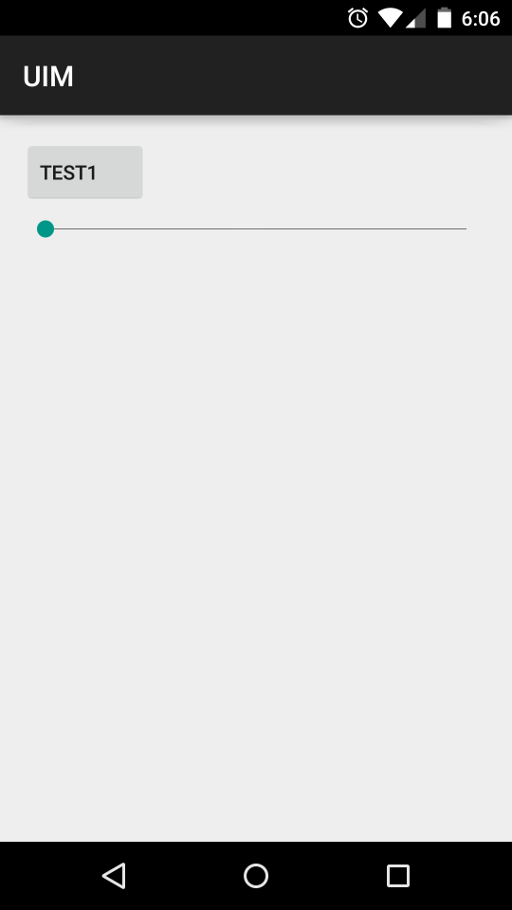

#Android User Interface Markup (UIM)

UIM enables developers to build android apps with dynamically generated native user interfaces at runtime. UIs are generated with JSON objects following a format much like Android native XML.

##Features
 - Build UIs at runtime
 - Capture events in a global event handler
 - Support for many android UI APIs. (More coming soon)
 - Package views together in an event (more on this in Handling Events)

##TODO
 - Add more View property support
 - Add more native views (and their events)

##Usage
 1. Implement `IuimEvents`
 2. Construct a `UiAssembler`
 3. call `UiAssembler.parseAndApplyView()` when you are ready to build the UI and set up event handlers. `.parseAndApplyView()` will automatically add the new view to the parent you supplied in the constructor. 
 
##Supported Views and layouts
###Supports layout/view up to API level 10 (2.3.3)
All listed views and layouts are supported to some degree. 
 - [LinearLayout](http://developer.android.com/reference/android/widget/LinearLayout.html) - complete
 - [LinerLayout.LayoutParams](http://developer.android.com/reference/android/widget/LinearLayout.LayoutParams.html) - complete
 - [RelativeLayout](http://developer.android.com/reference/android/widget/RelativeLayout.html) - complete
 - [RelativeLayout.LayoutParams](http://developer.android.com/reference/android/widget/RelativeLayout.LayoutParams.html) - complete
 - [ViewGroup.MarginLayoutParams](http://developer.android.com/reference/android/view/ViewGroup.MarginLayoutParams.html) - complete
 - [ViewGroup.LayoutParams](http://developer.android.com/reference/android/view/ViewGroup.LayoutParams.html) - complete
 - [ViewGroup](http://developer.android.com/reference/android/view/ViewGroup.LayoutParams.html) - complete
 - [View](http://developer.android.com/reference/android/view/View.html) - very incomplete
 - [TextView](http://developer.android.com/reference/android/widget/TextView.html) - very incomplete
    - [View.OnClickListener.onClick](http://developer.android.com/reference/android/view/View.OnClickListener.html#onClick(android.view.View)) handled
 - [Button](http://developer.android.com/reference/android/widget/Button.html) - complete, but missing inherited text view components
    - [View.OnClickListener.onClick](http://developer.android.com/reference/android/view/View.OnClickListener.html#onClick(android.view.View)) handled
 - [SeekBar](http://developer.android.com/reference/android/widget/SeekBar.html) - incomplete
    - [SeekBar.OnSeekBarChangeListener.onStopTrackingTouch](http://developer.android.com/reference/android/widget/SeekBar.OnSeekBarChangeListener.html#onStopTrackingTouch(android.widget.SeekBar)) - handled

##Special JSON Attributes
Attribute            |     Description
--------            |     ----
`uim_children`      | An array of children, can be any view or layout
`uim_eventPackage`  | An array of string IDs of other elements. These elements will be packaged in the event propagated by the view this is attached to. 

##Handling Events
When you implement `IuimEvents`, you must override `onEvent(Event event)`.
This method is called whenever a view receives a supported event. The event class contains the String ID of the object provided in JSON, the View itself and an array of packaged views (as defined in JSON). It is up to you to decide how you want to handle these events. 

##Simple Example

    {
        "Version": 1,
        "LinearLayout": {
            "layout_width": "match_parent",
            "layout_height": "match_parent",
            "uim_children": [ 
                { 
                    "Button": {
                        "id": "test1",
                        "text": "test1",
                        "gravity": "left|center",
                        "layout_width": "wrap_content",
                        "layout_height": "wrap_content",
                        "uim_eventPackage": [
                            "test2"
                        ]
                    }
                },
                {
                    "SeekBar": {
                        "id": "test2",
                        "text": "test2",
                        "layout_width": "match_parent",
                        "layout_height": "wrap_content"
                    }
                }
            ]
        }
    }

####Produces

